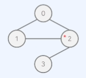
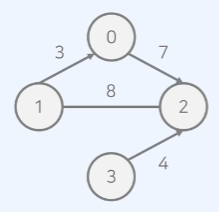
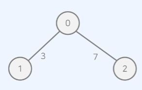

## 그래프(Graph)
### 개념
- 사물을 정점(vertex/node)과 간선(edge)로 나타내기 위한 도구
- 구현 방식
    - 인접 행렬(adjacency matrix) : 2차원 배열 사용
    - 인접 리스트(adjacency list) : 연결 리스트 사용

<br/>

### 인접 행렬(Adjacency Matrix)
- 그래프를 2차원 배열로 표현

#### 무방향 무가중치 그래프

 

- 무방향 그래프 : 모든 간선이 방향성을 가지지 않는 그래프
- 무가중치 그래프 : 모든 간선에 가중치가 없는 그래프

```javascript
let graph = [
        [0, 1, 1, 0],
        [1, 0, 1, 0],
        [1, 1, 0, 1],
        [0, 0, 1, 0]
];
```

<br/>

#### 방향 가중치 그래프
 

- 방향 그래프 : 모든 간선이 방향을 가지는 그래프
- 가중치 그래프 : 모든 간선에 가중치가 있는 그래프

```javascript
let graph = [
    [0, 0, 7, 0],
    [3, 0, 8, 0],
    [0, 8, 0, 0],
    [0, 0, 4, 0]
]
```

<br/>

### 인접 리스트(Adjacency List)
- 그래프를 리스트로 표현

 
 ```java
 0 : [(1, 3), (2, 7)] // 1번 노드로 가는 비용 3, 2번 노드로 가는 비용 7
 1: [(0, 3)]
 2: [(0, 7)]
 ```

#### 무방향 무가중치 그래프

  

  ```javascript
  let graph = [
    [1, 2], // index 0 : 0번 노드에서 1, 2로 이동 가능
    [0, 2],
    [0, 1, 3],
    [2]
  ]
  ```

#### 방향 가중치 그래프

 

 ```javascript
 let graph = [
    [(2, 7)], // index 0 : 0번 노드에서 2번 노드로 가는 비용 7
    [(0, 3), (2, 8)],
    [(1, 8)],
    [(2, 4)]
 ];
 ```

 <br/>

 ### 시간복잡도
 #### 인접 행렬
 - 모든 정점들의 연결 여부를 저장해 ```O(V²)```의 공간 요구
 - 공간 효율성이 떨어지나, 두 노드의 연결 여부를 ```O(1)```에 확인

 #### 인접 리스트
 - 연결된 간선의 정보만을 저장해 ```O(V + E)```의 공간 요구
 - 공간 효율성이 우수하나, 두 노드의 연결 여부를 확인하기 위해 ```O(V)```의 시간 필요(연결된 모든 간선을 확인해야 하기 때문)

#### 문제 상황에 맞게 선택해야 함!
- 예) 최단 경로 알고리즘의 경우에는 각각 근처 노드와 연결된 경우가 많음 -> 간선개수가 적으므로 인접 리스트가 유리